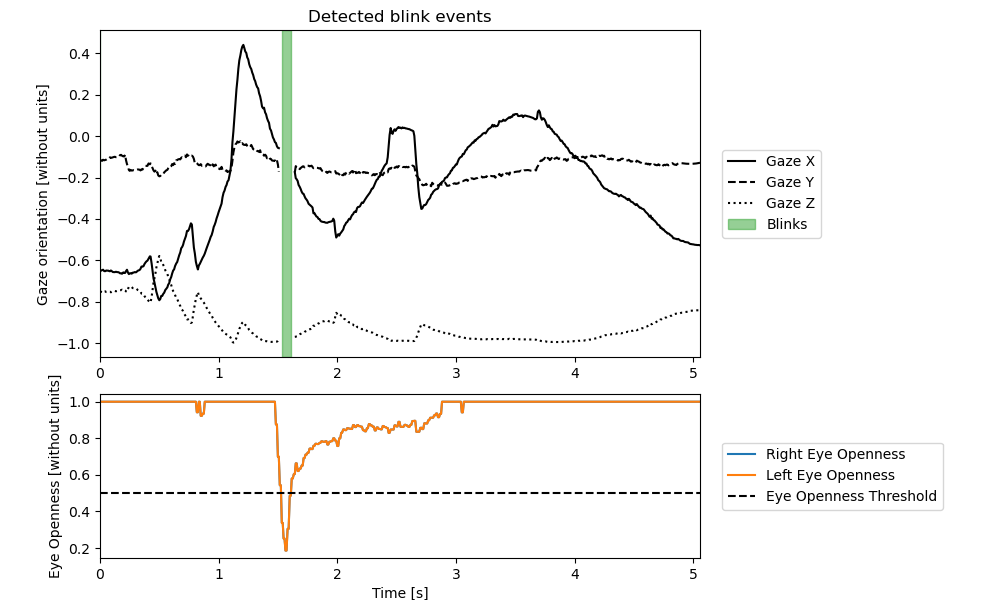

# Blink detection

```{note}
Blink definition: We define a blink as the sequence enclosed between eye lids closure and reopening.
```

How to detect blinks: 
```python3 
gaze_behavior_identifier.detect_blink_sequences(eye_openness_threshold)
```

Implementation:
A blink is detected if the eye openness of both eyes drop bellow the `eye_openness_threshold` {cite}`Chen:2021`.
Please note that there is no minimum or maximum duration for a blink.


Parameters:
- `eye_openness_threshold (float)`: The maximal eye openness to consider a blink. The default is `0.5`.



Figure 1 - Plot obtained using `gaze_behavior_identifier.blink.plot(save_name)`.

Available blink metrics: 
- `gaze_behavior_identifier.blink.nb_events`: The number of blinks in the trial.
- `gaze_behavior_identifier.blink.duration`: The duration of each blink in the trial.
- `gaze_behavior_identifier.blink.mean_duration`: The mean duration of the blinks in the trial.
- `gaze_behavior_identifier.blink.max_duration`: The duration of the longest blink in the trial.
- `gaze_behavior_identifier.blink.total_duration`: The total time spent doing blinks in the trial.
- `gaze_behavior_identifier.blink.ratio`: The proportion ot time of the trial spent doing blinks.
