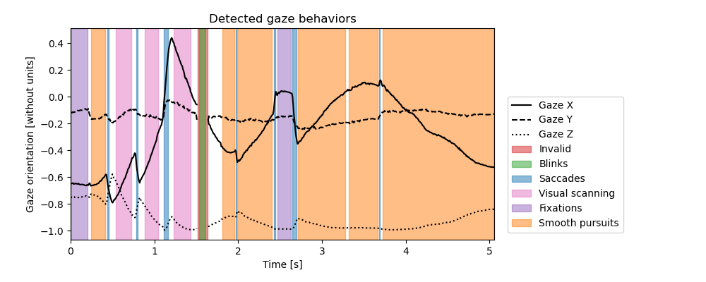

# Gaze behavior definition and identification

In the following subsections, you will find an explanation on how the different gaze behaviors are extracted using `EyeDentify3D`. 


Animation 1 - Animation obtained using `gaze_behavior_identifier.animate()`.


Figure 1 - Plot obtained using `gaze_behavior_identifier.plot(save_name)`.


```{tableofcontents}
```