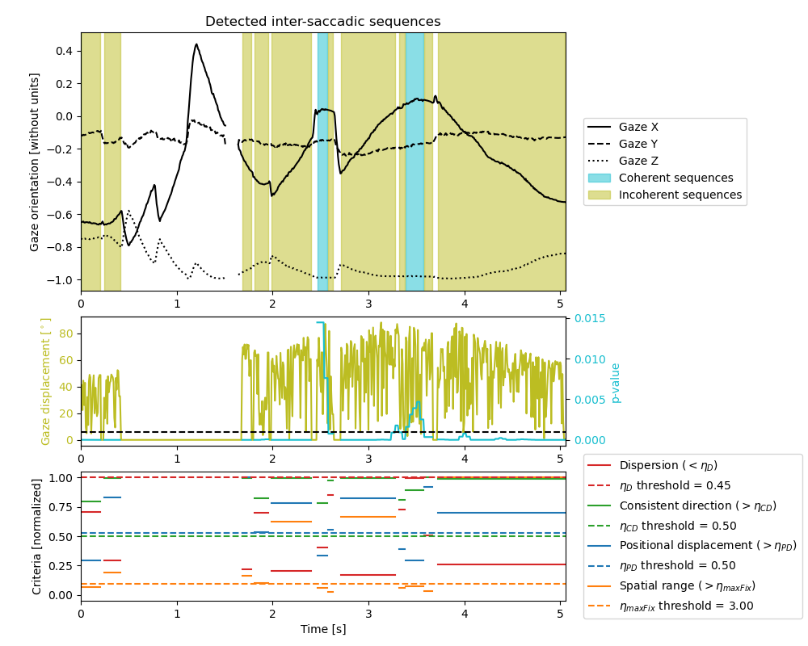

# Inter-saccadic sequences detection

```{admonition} Inter-saccadic sequence definition
An inter-saccadic sequence is not a gaze behavior. The remaining frames between 
previously identified gaze behaviors are split into coherent or incoherent inter_saccadic sequences.
```

## Implementation
All frames that have not been identified yet are split into windows that are overlapping a little bit at the beginning and end.
The coherence of the gaze movements inside each window is assessed using a Rayleigh z-test. 
First, the gaze movement is extracted by computing the gaze endpoint displacement vector between consecutive frames.
Then, the angle formed by the gaze end point movement and a specified axis. 
A Rayleigh z-test is performed on this angle to determine if the gaze movement is coherent (i.e., the p-value is smaller than eta_p), meaning that the gaze is moving in a particular direction.
As there is an overlap between the windows, the mean p-values across all windows in which it was part of is used to determine the coherence of this frame.
The adjacent coherent (or incoherent) windows are merged to form larger coherent (or incoherent) sequences {cite}`Larsson:2015`.
These sequences are then each analyzed to determine if they should be identified as a fixation, sequence, or undefined sequence by computing four parameters {cite}`Larsson:2015`.
    1) Dispersion: # TODO: add the definition from Larsson
    2) Direction consistency: # TODO: add the definition from Larsson
    3) Positional displacement: # TODO: add the definition from Larsson
    4) Spatial range: # TODO: add the definition from Larsson
See the sections [fixation](fixation.md) and [smooth_pursuit](smooth_pursuit.md) detection sections for their interpretation.


Figure 1 - Plot obtained using `gaze_behavior_identifier.inter_saccadic_sequences.plot(save_name)`.

## Limitation
The computation of the gaze movement angle only works if it is possible to predict on which axis the gaze will move during the trial (e.g., when following a freeze-bee the gaze movement should be mainly horizontal).
If you need to extract intersaccadic sequences, fixations, or saccades from your trials and you cannot predict the axis on which the gaze will be moving the most, please notify the developer by opening an issue on [GitHub](https://github.com/EveCharbie/EyeDentify3d/issues).

## Parameters
- `window_duration (float)`: The length of the windows. The default is `0.022` s.
- `window_overlap (float)`: The duration by which the windows must overlap at their extremities. The default is `0.006` s.
- `minimal_duration (float)`: The minimal duration for which the gaze behavior must be consistent or inconsistent to consider the inter-saccadic interval. The default is `0.04` s.
- `min_velocity_threshold (float)`: The minimal gaze velocity to consider a visual scanning. The default is `100`°/s. # TODO: CITE
- `eta_p (float)`: The maximal p-value to consider a sequence as incoherent. The default is `0.001`.
- `eta_d (float)`: The minimal dispersion. The default is `0.45`.
- `eta_cd (float)`: The maximal direction consistency. The default is `0.5`.
- `eta_pd (float)`: The maximal positional displacement. The default is `0.2`.
- `eta_max_fixation (float)`: The maximal fixation spatial range. The default is `1.9`°.
- `eta_min_smooth_pursuit (float)`: The minimal smooth pursuit spatial range. The default is `1.7`°.
- `phi (float)`: The maximal angular difference to consider two sequences to have a displacement in the same direction. The default is `45`°.

## Available inter-saccadic sequences
- `gaze_behavior_identifier.inter_saccadic_sequences.sequences`: The coherent and incoherent sequences present in the trial.
- `gaze_behavior_identifier.inter_saccadic_sequences.coherent_sequences`: The coherent sequences present in the trial.
- `gaze_behavior_identifier.inter_saccadic_sequences.incoherent_sequences`: The incoherent sequences present in the trial.

```{tableofcontents}
```