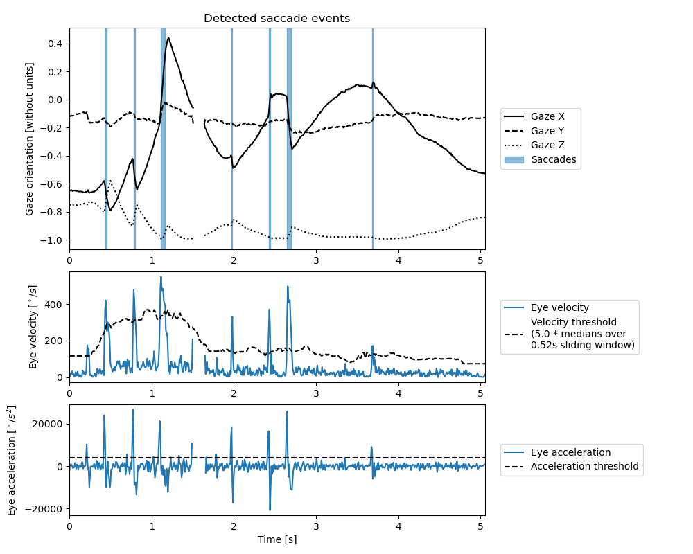

# Saccade detection

```{admonition} Saccade definition
We define a saccade as a sequence aiming to reposition the eyes quickly between two targets.
```

## How to detect saccades
```python3 
gaze_behavior_identifier.detect_saccade_sequences(
        min_acceleration_threshold,
        nb_acceleration_frames,
        velocity_window_size,
        velocity_factor,
    )
```

## Implementation
A saccade is detected if two conditions are met.
    1) The eye velocity is larger than a time varying threshold. The threshold is defined as a multiple of the gaze velocity rolling median.
    2) The eye acceleration is larger than the threshold for at least two frames.
This implementation is based on the typical eye velocity profile observed during a saccade (see [figure](https://www.researchgate.net/figure/Saccade-a-angle-and-b-angular-velocity_fig5_313539565)) where we eyes accelerate while taking off from the initial target to reach a high velocity before decelerating to land on the new target.
Please note that only the eye repositioning is assessed, therefore we consider that a saccade can be observed between any other kind of behavior (not only fixation). 
Also, the saccade identification considers only the eye velocity profile (head movements are ignored).


Figure 1 - Plot obtained using `gaze_behavior_identifier.saccade.plot(save_name)`.

## Limitation
There is often a blink happening during saccades when the saccade amplitude is large {cite}`Evinger:1994`. 
However, in `EyeDentify3D` we consider all gaze behaviors to be mutually exclusive. 
So `EyeDentify3D` would, identify two saccades split by a blink.
If your study requires overcoming this limitation, please contact the developer by opening an issue on [GitHub](https://github.com/EveCharbie/EyeDentify3d/issues).

## Parameters
- `min_acceleration_threshold (float)`: The minimal eye acceleration to consider a saccade. The default is `4000`°/s^2 {cite}`Holmqvist:2011`. # TODO: CITE
- `velocity_window_size (float)`: The duration of the window used to compute the rolling median of the eye velocity. The default is `0.52` s.
- `velocity_factor (float)`: The coefficient by which the eye velocity must surpass the rolling median of the eye velocity to consider a saccade. The default is `5.0`.

## Available saccade metrics
- `gaze_behavior_identifier.saccade.nb_events`: The number of saccades in the trial.
- `gaze_behavior_identifier.saccade.duration`: The duration of each saccade in the trial.
- `gaze_behavior_identifier.saccade.mean_duration`: The mean duration of the saccades in the trial.
- `gaze_behavior_identifier.saccade.max_duration`: The duration of the longest saccade in the trial.
- `gaze_behavior_identifier.saccade.total_duration`: The total time spent doing saccades in the trial.
- `gaze_behavior_identifier.saccade.ratio`: The proportion ot time of the trial spent doing saccades.
- `gaze_behavior_identifier.saccade.saccade_amplitudes`: The amplitudes of each saccade in the trial.
