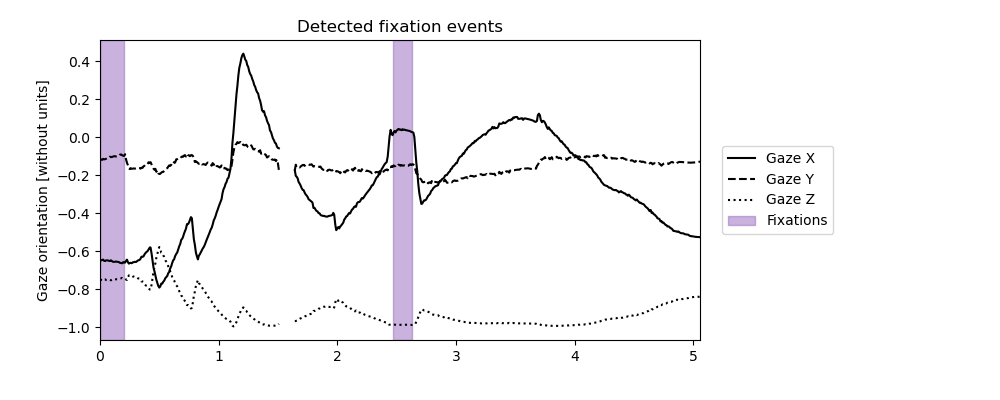

# Smooth pursuit detection

```{note}
Smooth pursuit definition: We define a smooth pursuit as a sequence aiming to stabilize the gaze endpoint on an object moving in the world reference frame.
```

How to detect smooth pursuit: 
```python3 
gaze_behavior_identifier.detect_fixation_and_smooth_pursuit_sequences(
        inter_saccade_minimal_duration,
        fixation_minimal_duration,
        smooth_pursuit_minimal_duration,
        window_duration,
        window_overlap,
        eta_p,
        eta_d,
        eta_cd,
        eta_pd,
        eta_max_fixation,
        eta_min_smooth_pursuit,
        phi,
    )
```

Implementation:
Smooth pursuits are identified if the following {cite}`Larsson:2015` criteria are met.
    1) `Dispersion` < $\eta_d$ and `Directional consistency` > $\eta_{CD} and `Positional displacement` > $\eta_{PD} and `Spatial range` > $\eta_{maxFix}
    2) `Positional displacement` > $\eta_{PD} and `Spatial range`* > $\eta_{minSP}
    3) `Positional displacement` < $\eta_{PD} and `Spatial range` > $\eta_{minFix}
* Here, the `Spatial range` is computed on the current sequence merged with all adjacent smooth pursuit sequences

Parameters:
- `window_duration (float)`: The length of the windows. The default is `0.022` s.
- `window_overlap (float)`: The duration by which the windows must overlap at their extremities. The default is `0.006` s.
- `minimal_duration (float)`: The minimal duration for which the gaze behavior must be consistent or inconsistent to consider the inter-saccadic interval. The default is `0.04` s.
- `min_velocity_threshold (float)`: The minimal gaze velocity to consider a visual scanning. The default is `100`°/s. # TODO: CITE
- `eta_p (float)`: The maximal p-value to consider a sequence as incoherent. The default is `0.001`.
- `eta_d (float)`: The maximal dispersion. The default is `0.45`.
- `eta_cd (float)`: The minimal direction consistency. The default is `0.5`.
- `eta_pd (float)`: The minimal positional displacement. The default is `0.2`.
- `eta_min_smooth_pursuit (float)`: The minimal smooth pursuit spatial range. The default is `1.7`°.
- `phi (float)`: The maximal angular difference to consider two sequences to have a displacement in the same direction. The default is `45`°.


Figure 1 - Plot obtained using `gaze_behavior_identifier.smooth_pursuit.plot(save_name)`.

Available smooth pursuit metrics: 
- `gaze_behavior_identifier.smooth_pursuit.nb_events`: The number of fixations in the trial.
- `gaze_behavior_identifier.smooth_pursuit.duration`: The duration of each fixation in the trial.
- `gaze_behavior_identifier.smooth_pursuit.mean_duration`: The mean duration of the fixations in the trial.
- `gaze_behavior_identifier.smooth_pursuit.max_duration`: The duration of the longest fixation in the trial.
- `gaze_behavior_identifier.smooth_pursuit.total_duration`: The total time spent doing fixations in the trial.
- `gaze_behavior_identifier.smooth_pursuit.ratio`: The proportion ot time of the trial spent doing fixations.
- `gaze_behavior_identifier.smooth_pursuit.smooth_pursuit_trajectories`: The angular trajectory of the gaze during the smooth pursuits. It is computed as the Forward Euler integral of the gaze velocity.

