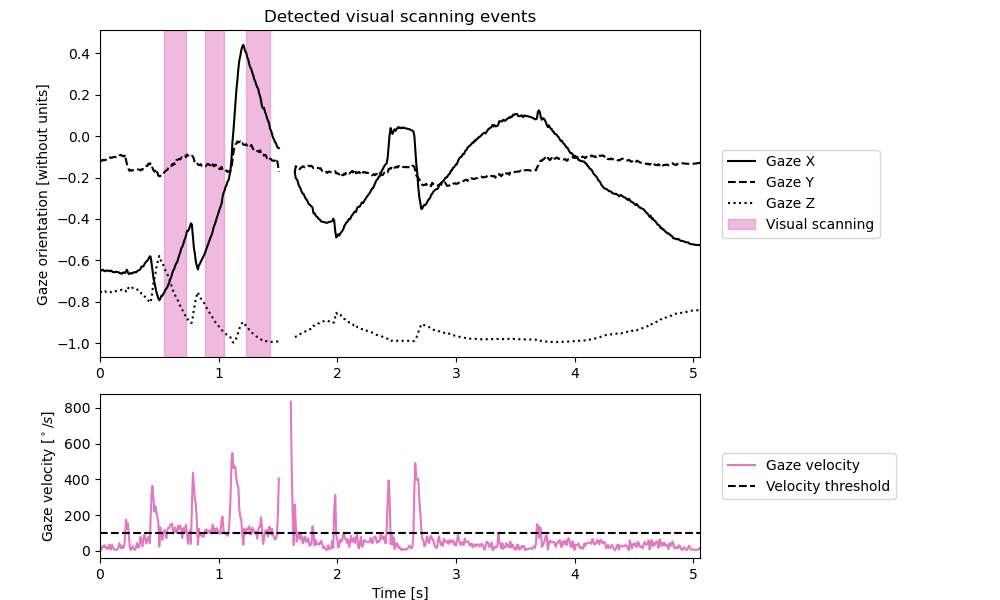

# Visual scanning detection

```{admonition} Visual scanning definition
We define visual acanning as a sequence where the gaze (eye + head) is moving rapidly to find information rich portions of the environement. 
Due to the important gaze velocity, visual scanning mainly rely on peripheral vision. # TODO: Cite visual scanning Thomas ?
```

## How to detect visual scanning
```python3 
gaze_behavior_identifier.detect_visual_scanning_sequences(
        min_velocity_threshold,
        minimal_duration,
    )
```

## Implementation
A visual scanning event is detected when the gaze velocity is above the `min_velocity_threshold` for longer than the `minimal_duration`.


Figure 1 - Plot obtained using `gaze_behavior_identifier.visual_scanning.plot(save_name)`.

## Parameters
- `min_velocity_threshold (float)`: The minimal gaze velocity to consider a visual scanning. The default is `100`°/s. # TODO: CITE
- `minimal_duration (float)`: The minimal duration for which the gaze velocity must surpass the threshold to consider a visual scanning. The default is `0.04` s.

## Available visual scanning metrics
- `gaze_behavior_identifier.visual_scanning.nb_events`: The number of visual scanning events in the trial.
- `gaze_behavior_identifier.visual_scanning.duration`: The duration of each visual scanning in the trial.
- `gaze_behavior_identifier.visual_scanning.mean_duration`: The mean duration of the visual scanning events in the trial.
- `gaze_behavior_identifier.visual_scanning.max_duration`: The duration of the longest visual scanning in the trial.
- `gaze_behavior_identifier.visual_scanning.total_duration`: The total time spent doing visual scanning events in the trial.
- `gaze_behavior_identifier.visual_scanning.ratio`: The proportion ot time of the trial spent doing visual scanning.

